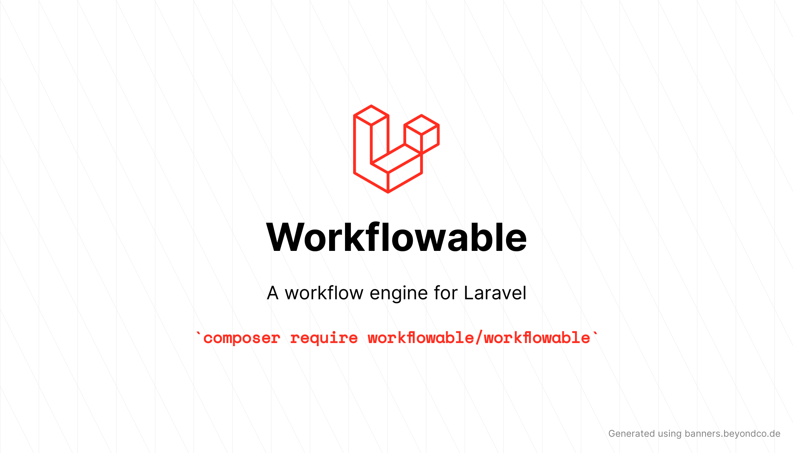

[](https://packagist.org/packages/workflowable/workflowable)
[](https://github.com/workflowable/workflowable/actions?query=workflowable%3Arun-tests+branch%3Amaster)
[](https://github.com/workflowable/workflowable/actions?query=workflowable%3A"Fix+PHP+code+style+issues"+branch%3Amaster)
[](https://packagist.org/packages/workflowable/workflowable)

## Workflowable

At its core, a workflow engine orchestrates the sequence of activities required to accomplish a specific task or achieve a particular outcome. It allows users to design and model complex workflows by defining the activities and conditions that govern the flow of work. These workflows can range from simple, linear processes to highly intricate and conditional ones involving multiple participants, decision points, and integrations with various systems.

> **Note**: This is an early release and is not ready for production usage. APIs are subject to change. This early release aims to gather feedback and design suggestions while the core development is in progress. Documentation will be added as the APIs stabilize.

## Installation

You can install the package via composer:

```bash
composer require workflowable/workflowable
```

You can publish the config file with:

```bash
php artisan vendor:publish --tag="workflowable-config"
```

This is the contents of the published config file:

```php
return [
    /**
     * The queue to use for workflow events.
     */
    'queue' => 'default',

    /**
     * The broadcast channel we should use for all Laravel events for the workflowable package.
     */
    'broadcast_channel' => 'workflowable',
];

```

## Testing

```bash
composer test
```

## Contributing

Please see [CONTRIBUTING](CONTRIBUTING.md) for details.

## Credits

- [Andrew Leach](https://github.com/Workflowable)
- [All Contributors](../../contributors)

## License

The MIT License (MIT). Please see [License File](LICENSE.md) for more information.
