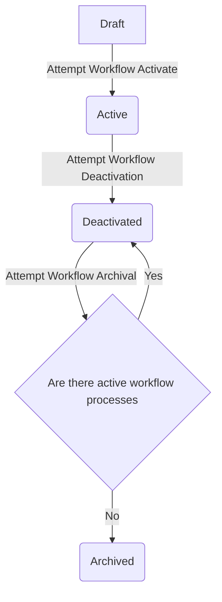

# Workflows

**Workflows** are the definition of a process or a series of steps that need to be performed to complete a process or
achieve a desired outcome. They can be configured to be as simple or complex as needed through the usage of workflow
steps, transitions and conditions.

## Workflow Priorities

**Workflow priority** refers to the relative importance or urgency of a workflow. It is used to determine the order in
which workflow runs are executed when multiple workflows are triggered at the same time.  Right now, the priority is
a simple integer value, where the greater the value the greater the priority.  In the event that two workflows have
the same priority, the workflow that was created first will be executed first.

## Workflow States

| ID | Name        | Description                                                                                                                             |
|----|-------------|-----------------------------------------------------------------------------------------------------------------------------------------|
| 1  | Draft       | Indicates that the workflow in question is still being prepped, and no processes will be created for it                                 |
| 2  | Active      | Indicates that when a workflow event is triggered, we should create a new workflow process for that workflow                            |
| 3  | Deactivated | Indicates that we no longer want to create new workflow processes for that workflow, but there may be active workflow processes for it. |
| 4  | Archived    | We are no longer creating new workflow processes and there are no existing, active workflow processes in the system                     |

### Workflow State Transitions

