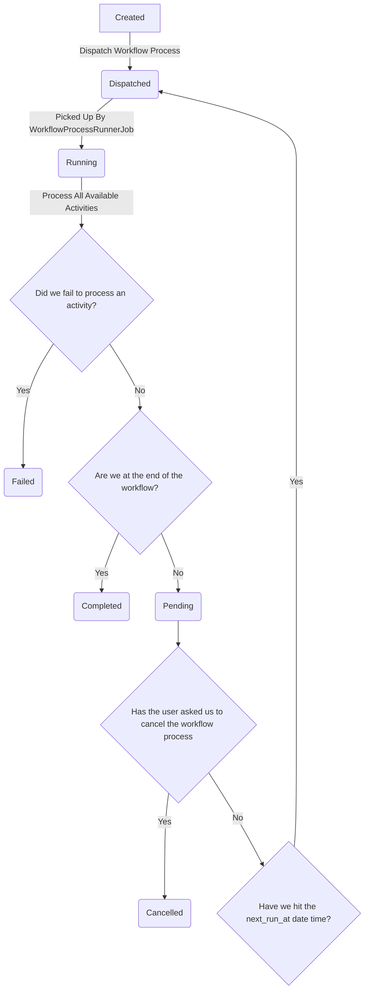

# Workflow Process Lifecycle

```mermaid
flowchart TD
    A[Created] -->|Dispatch Workflow Process| B(Dispatched)
    B -->|Picked Up By WorkflowProcessRunnerJob| C(Running)
    C -->|Process All Available Activities| D{Did we fail to process an activity?}
    D -->|Yes| E(Failed)
    D -->|No| F{Are we at the end of the workflow?}
    F -->|Yes| G(Completed)
    F -->|No| H(Pending)
    H --> I{Has the user asked us to cancel the workflow process}
    I -->|Yes| J(Cancelled)
    I -->|No| K{Have we hit the next_run_at date time?}
    K -->|Yes| B
```
