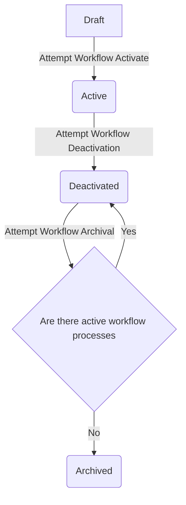

# Workflows

**Workflows** are the definition of a process or a series of steps that need to be performed to complete a process or
achieve a desired outcome. They can be configured to be as simple or complex as needed through the usage of workflow
steps, transitions and conditions.

## Workflow Activities

A **workflow activity** represents a specific action or unit of work within a workflow. It is a fundamental building block
of a workflow, defining the individual actions or operations that need to be performed to complete a process or achieve a desired outcome.

### How do I define what a workflow activity should be doing?

The definition of what a workflow activity should perform is called a **workflow activity type**. This data structure should be
responsible for validating your parameters and identifying data dependencies in the workflow run parameters.

### How do I create a workflow activity type?

You can create a new workflow activity type by running the following command:

```bash
php artisan make:make:workflow-activity-type {name}
```

This will generate a new class in the `app/Workflows/WorkflowActivityTypes` directory. You can then define the logic
for you to begin writing your new workflow activity type.

### How do I register a workflow activity type?

You can register a workflow activity type by adding it to the `workflowable.workflow_activity_types` config file.

## Workflow Transitions

A **workflow transition** refers to the movement or progression of a workflow from one activity to another. It
represents the path or connection between two workflow activities, indicating the flow of work and the logical sequence of actions within a workflow.

### How can I add conditions to determine what transitions are eligible to be performed?

You can do this through one or more **workflow conditions**. Like workflow activities, workflow conditions have a workflow
condition type that validates, defines dependencies, and handles executing the code to check whether a specific condition is met.

### How do I define what a workflow condition should be doing?

The definition of what a workflow condition should perform is called a **workflow condition type**. This data
structure should be responsible for validating your parameters and identifying data dependencies in the workflow run
parameters. Additionally, it should be responsible for executing the code to check whether a specific condition is met.

### How do I create a workflow condition type?

You can create a new workflow condition type by running the following command:

```bash
php artisan make:make:workflow-condition-type {name}
```

This will generate a new class in the `app/Workflows/WorkflowConditionTypes` directory. You can then define the logic
for you to begin writing your new workflow activity type.

### How do I register a workflow condition type?

You can register a workflow condition type by adding it to the `workflowable.workflow_condition_types` config file.

## Restrictions

#### Restricting Activities/Conditions To Events
For workflows, you may have specific activities or conditions that are only ever going to be relevant to a specific 
event, and as such you do not want to display it as an option for a user to choose when workflow building.  You can
accomplish this by adding the `ShouldRestrictToWorkflowEvents` interface to your Workflow Activity/Condition class and
then filling out the `getWorkflowEventAliases` method with the aliases of the events you want to scope it to.  Example:

```php
public function getWorkflowEventAliases(): array;
{
    return [
        (new UserRegistered())->getAlias(),
    ];
}
```

#### Requiring Input Tokens On Process Creation

When making a workflow activity or condition, sometimes you depend on specific tokens being provided to the workflow
process.  We provide the `ShouldRequireInputTokens` interface that you can add to your activities/conditions to let us know about those 
dependencies.  This will then require you to add the method `getRequiredWorkflowEventTokenKeys` to your 
activity/condition and specify the names of the tokens that must be provided to you for your activity/condition to run
successfully.  Example:

```php
public function getRequiredWorkflowEventTokenKeys(): array;
{
    return [
        'user_id',
    ];
}
```

## Integrity Testing

Workflows can be really complicated, and easy to break without realizing.  We help prevent this from happening by adding
an easy command to test the integrity which can be invoked using the following artisan command 
`php artisan workflowable:verify-integrity`


#### Github Action 

```yaml
name: Verify Workflowable Integrity

on:
  push:
    branches: [ "master" ]
  pull_request:
    branches: [ "master" ]

jobs:
  verify-workflowable-integrity:

    runs-on: ubuntu-latest

    steps:
    - uses: shivammathur/setup-php@15c43e89cdef867065b0213be354c2841860869e
      with:
        php-version: '8.2'
    - uses: actions/checkout@v3
    - name: Copy .env
      run: php -r "file_exists('.env') || copy('.env.example', '.env');"
    - name: Install Dependencies
      run: composer install -q --no-ansi --no-interaction --no-scripts --no-progress --prefer-dist
    - name: Generate key
      run: php artisan key:generate
    - name: Directory Permissions
      run: chmod -R 777 storage bootstrap/cache
    - name: Create Database
      run: |
        mkdir -p database
        touch database/database.sqlite
    - name: Verify Workflowable Integrity
      id: verify-integrity
      env:
        DB_CONNECTION: sqlite
        DB_DATABASE: database/database.sqlite
      run: |
        php artisan migrate
        php artisan workflowable:scaffold
        php artisan workflowable:verify-integrity
```


## Workflow Priorities

**Workflow priority** refers to the relative importance or urgency of a workflow. It is used to determine the order in
which workflow processes are executed when multiple workflows are triggered at the same time.  Right now, the priority is
a simple integer value, where the greater the value the greater the priority.  In the event that two workflows have
the same priority, the workflow that was created first will be executed first.

## Workflow States

| ID | Name        | Description                                                                                                                             |
|----|-------------|-----------------------------------------------------------------------------------------------------------------------------------------|
| 1  | Draft       | Indicates that the workflow in question is still being prepped, and no processes will be created for it                                 |
| 2  | Active      | Indicates that when a workflow event is triggered, we should create a new workflow process for that workflow                            |
| 3  | Deactivated | Indicates that we no longer want to create new workflow processes for that workflow, but there may be active workflow processes for it. |
| 4  | Archived    | We are no longer creating new workflow processes and there are no existing, active workflow processes in the system                     |

### Workflow State Transitions


