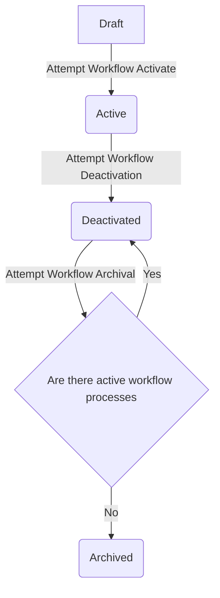

# Workflows

**Workflows** define a series of steps or processes required to achieve a desired outcome. They offer flexibility, allowing for both simple and complex configurations through the use of workflow steps, transitions, and conditions.

## Workflow Activities

A **workflow activity** represents a specific action or unit of work within a workflow, serving as a fundamental building block. It defines individual actions or operations necessary to complete a process or achieve a desired outcome.

### Defining Workflow Activity Types

The definition of what a workflow activity should perform is encapsulated in a **workflow activity type**. This structure is responsible for parameter validation and identifying data dependencies in workflow process parameters.

### Creating Workflow Activity Types

Generate a new workflow activity type using the following command:

```bash
php artisan make:workflow-activity-type {name}
```

This creates a class in the `app/Workflows/WorkflowActivityTypes` directory, where you can define the logic for your new workflow activity type.

### Registering Workflow Activity Types

Register a workflow activity type by adding it to the `workflowable.workflow_activity_types` config file.

## Workflow Transitions

A **workflow transition** denotes the movement or progression of a workflow from one activity to another, representing the logical sequence of actions. It signifies the path or connection between two workflow activities.

### Adding Conditions to Transitions

Conditions for determining eligible transitions can be added through one or more **workflow conditions**. Workflow conditions, like activities, have a type responsible for validation, defining dependencies, and executing the code to check whether a specific condition is met.

### Defining Workflow Condition Types

The definition of what a workflow condition should perform is contained in a **workflow condition type**. This structure is responsible for parameter validation, identifying data dependencies in workflow process parameters, and executing the code to check conditions.

### Creating Workflow Condition Types

Create a new workflow condition type with the command:

```bash
php artisan make:workflow-condition-type {name}
```

This generates a class in the `app/Workflows/WorkflowConditionTypes` directory, where you can define the logic for your new workflow condition type.

### Registering Workflow Condition Types

Register a workflow condition type by adding it to the `workflowable.workflow_condition_types` config file.

## Restrictions

#### Restricting Activities/Conditions To Events

For workflows with activities or conditions specific to certain events, implement the `ShouldRestrictToWorkflowEvents` interface. Define the events by filling out the `getWorkflowEventAliases` method in your Workflow Activity/Condition class.

Example:

```php
public function getWorkflowEventAliases(): array;
{
    return [
        (new UserRegistered())->getAlias(),
    ];
}
```

#### Requiring Input Tokens On Process Creation

Use the `ShouldRequireInputTokens` interface to declare dependencies on specific tokens for workflow activities or conditions. Implement the `getRequiredWorkflowEventTokenKeys` method in your activity/condition to specify the required token names.

Example:

```php
public function getRequiredWorkflowEventTokenKeys(): array;
{
    return [
        'user_id',
    ];
}
```

## Integrity Testing

To prevent inadvertent issues with complex workflows, test the integrity using the command:

```bash
php artisan workflowable:verify-integrity
```

### GitHub Action Example

```yaml
name: Verify Workflowable Integrity

on:
  push:
    branches: [ "master" ]
  pull_request:
    branches: [ "master" ]

jobs:
  verify-workflowable-integrity:

    runs-on: ubuntu-latest

    steps:
    - uses: shivammathur/setup-php@15c43e89cdef867065b0213be354c2841860869e
      with:
        php-version: '8.2'
    - uses: actions/checkout@v3
    - name: Copy .env
      run: php -r "file_exists('.env') || copy('.env.example', '.env');"
    - name: Install Dependencies
      run: composer install -q --no-ansi --no-interaction --no-scripts --no-progress --prefer-dist
    - name: Generate key
      run: php artisan key:generate
    - name: Directory Permissions
      run: chmod -R 777 storage bootstrap/cache
    - name: Create Database
      run: |
        mkdir -p database
        touch database/database.sqlite
    - name: Verify Workflowable Integrity
      id: verify-integrity
      env:
        DB_CONNECTION: sqlite
        DB_DATABASE: database/database.sqlite
      run: |
        php artisan migrate
        php artisan workflowable:scaffold
        php artisan workflowable:verify-integrity
```

## Workflow Priorities

**Workflow priority** indicates the relative importance or urgency of a workflow. It determines the order in which workflow processes are executed when triggered simultaneously. Priority is represented by a simple integer value, where a higher value indicates greater priority. If two workflows have the same priority, the one created first is executed first.

## Workflow States

| ID | Name        | Description                                                                                                                             |
|----|-------------|-----------------------------------------------------------------------------------------------------------------------------------------|
| 1  | Draft       | The workflow is still being prepared, and no processes will be created for it                                                          |
| 2  | Active      | When a workflow event is triggered, a new workflow process is created for that workflow                                                  |
| 3  | Deactivated | No new workflow processes are created, but there may be active workflow processes for it                                                |
| 4  | Archived    | No new workflow processes are created, and there are no existing, active workflow processes in the system                              |

### Workflow State Transitions


